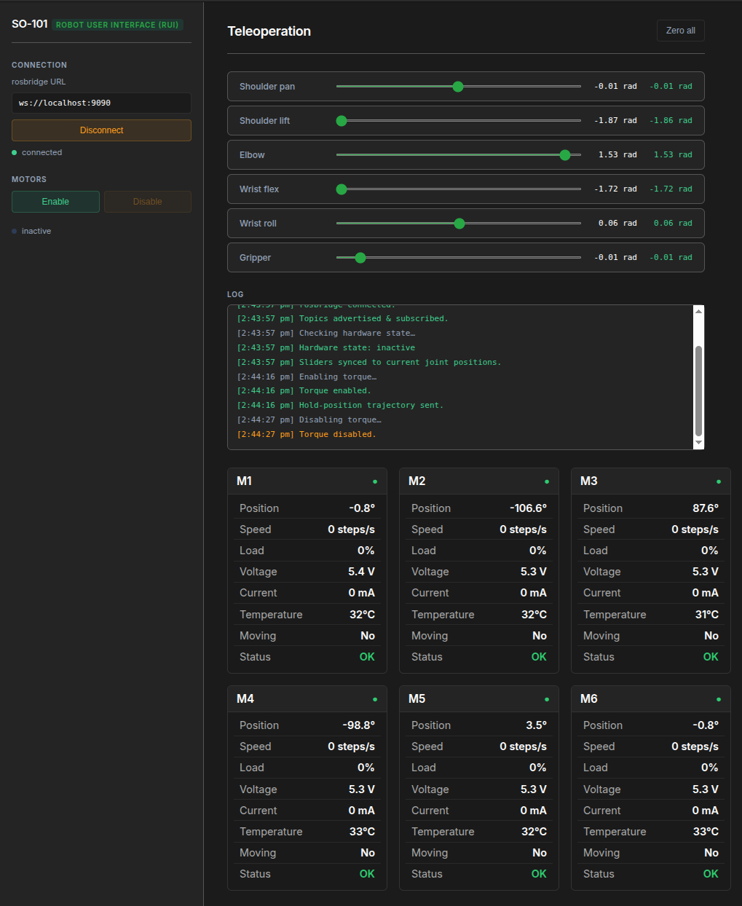

# SO-101 Robot User Interface (RUI) 🤖

⚠️ **Status: Work In Progress**  
*This repository is under development.*

---

## 🏗️ Current Development Focus
*   [X] Display telemetry data (Motor Feedback's)
*   [X] Teloperation using slider's
*   [ ] Joint recording: arm to specific pose -> sample joint values -> save coordinates sequence.
*   [ ] Playback: recorded coordinates for repeatability 

---

## 📱 Current User Interface

---